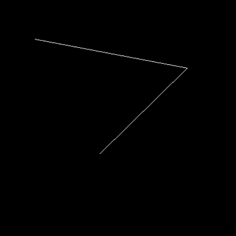
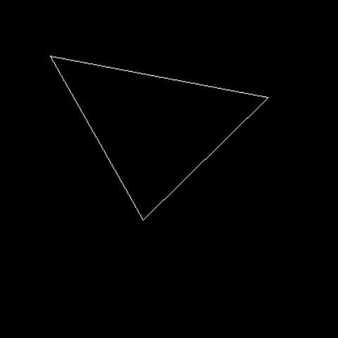
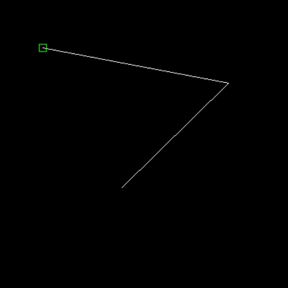
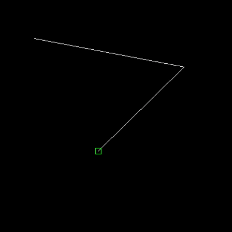
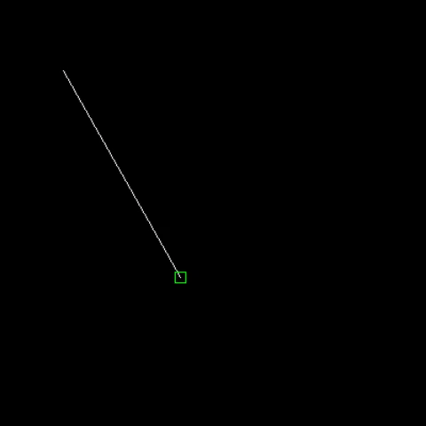
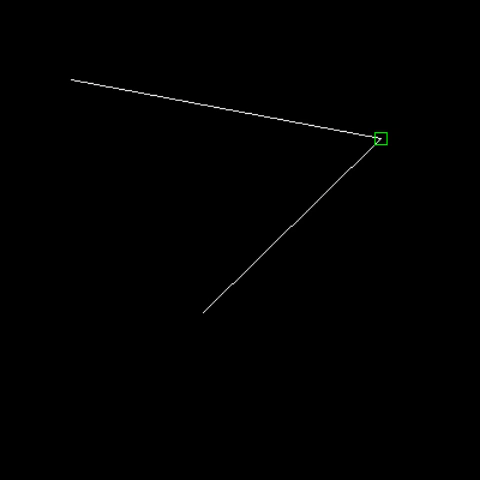
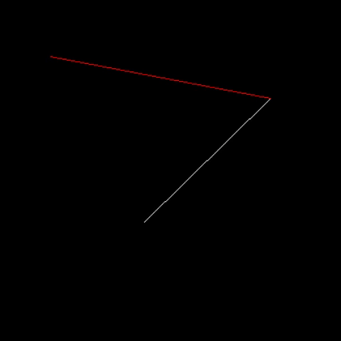
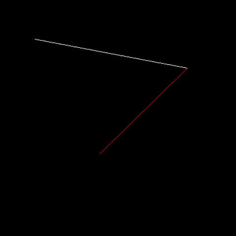
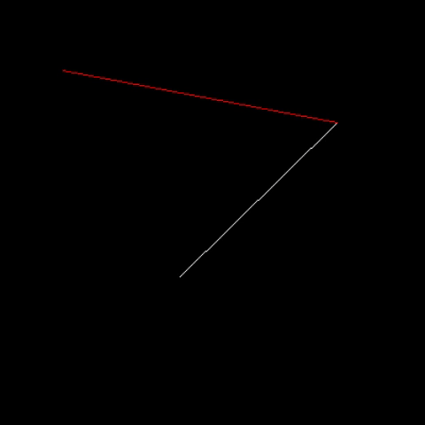

# Fondements et Algorithmes de l'Imagerie Numérique - Projet
Projet réalisé dans le cadre de l'UE "Fondements et Algorithmes de l'Imagerie Numérique"

## Installation des dépendances

    sudo apt-get install freeglut3-dev

## Objectif

L’objectif de ce projet  a été d'écrire un programme en C permettant à un utilisateur de dessiner un polygone plan et d'effectuer diverses opérations sur celui-ci.

## Lancement du programme

Après ouverture d'un terminal, écrire la commande `make` pour compiler le programme et le lancer avec `./plot [largeur] [valeur]`

## Manuel d'emploi

Le programme permet à l'utilisateur d'accéder à quelques fonctionnalités, dont les suivantes :

### Fermeture du polygone

Il est possible de fermer (respectivement ouvrir) le polygone à l'aide de la touche `c`, comme illustrée ci-dessous :

### Scan-line

La fonctionnalité `scan-line` permet de remplir (respectivement vider) le polygone grâce à la touche `f`, comme visible ci-dessous :

### Modes

Le programme possède également 3 modes différents :

#### Mode insert

Ce mode s'active en pressant la touche `i`. Il permet à l'utilisateur de créer des points sur le plan à l'aide du clique gauche de la souris :computer_mouse:, chaque nouveau point étant relié au précédent. Sur l'exemple ci-dessous, nous pouvons voir la création de trois points successifs correctement reliés entre eux par des droites de Bresenham :

#### Mode vertex

Ce mode, qui s'active en pressant la touche `v` possède 3 fonctionnalités :

##### fonctionnalité #1

La première fonctionnalité consiste à sélectionner un sommet du polygone, qui sera mis en évidence par rapport aux autres, comme illustré ci-dessous :

La sélection des sommets peut se faire de deux manières : soit en manipulant les touches `page suivante` :arrow_double_down: et `page précédente` :arrow_double_up: pour atteindre respectivement le sommet suivant et le sommet précédent ; soit en cliquant à l'aide du `clique gauche` de la souris :computer_mouse: sur le plan, le sommet le plus proche du clique étant celui sélectionné.

Il n'est cependant pas possible de passer du premier point au dernier (respectivement du dernier au premier point) à l'aide des touches si le polygone n'est pas fermé. Ci-dessous se trouve une illustration de cette possibilité :

##### fonctionnalité #2

La deuxième fonctionnalité permet de déplacer le point sélectionné vers le haut, le bas, la gauche ou la droite à l'aide des touches :arrow_up:, :arrow_down:, :arrow_left: et :arrow_right:. L'illustration suivante montre le déplacement du sommet vers la droite :

##### fonctionnalité #3

La troisième et dernière fonctionnalité consiste à effacer le sommet sélectionné à l'aide de la touche `suppr`, comme illustré ci-dessous :

Il est possible de supprimer l'intégralité du polygone, puis de redessiner à nouveau (ne pas oubliez de revenir au mode `insert` pour cela, les fonctionnalités d'un mode étant désactivées en passant d'un mode à l'autre).

#### Mode edge

Ce mode s'active à l'aide de la touche `e` et possède 2 fonctionnalités :

##### fonctionnalité #1

La première fonctionnalité est similaire à la première fonctionnalité du mode `vertex` : les touches `page suivante` :arrow_double_down: et `page précédente` :arrow_double_up: permettent de passer à l'arête suivante ou précédente et le `clique gauche` de la souris :computer_mouse: permet de sélectionner l'arête la plus proche :

Il n'est pas possible de parcourir le polygone à l'aide des touches si celui-ci n'est pas fermé. Cette possibilité est illustrée ci-dessous :

##### fonctionnalité #2

La deuxième et dernière fonctionnalité permet à l'utilisateur d'ajouter à l'aide du `bouton du milieu` de la souris :computer_mouse: un point au milieu de l'arête sélectionnée, comme illustré ci-dessous :

